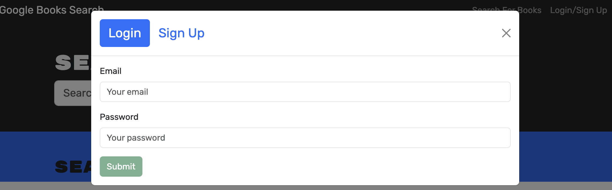
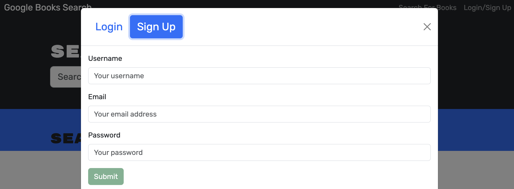
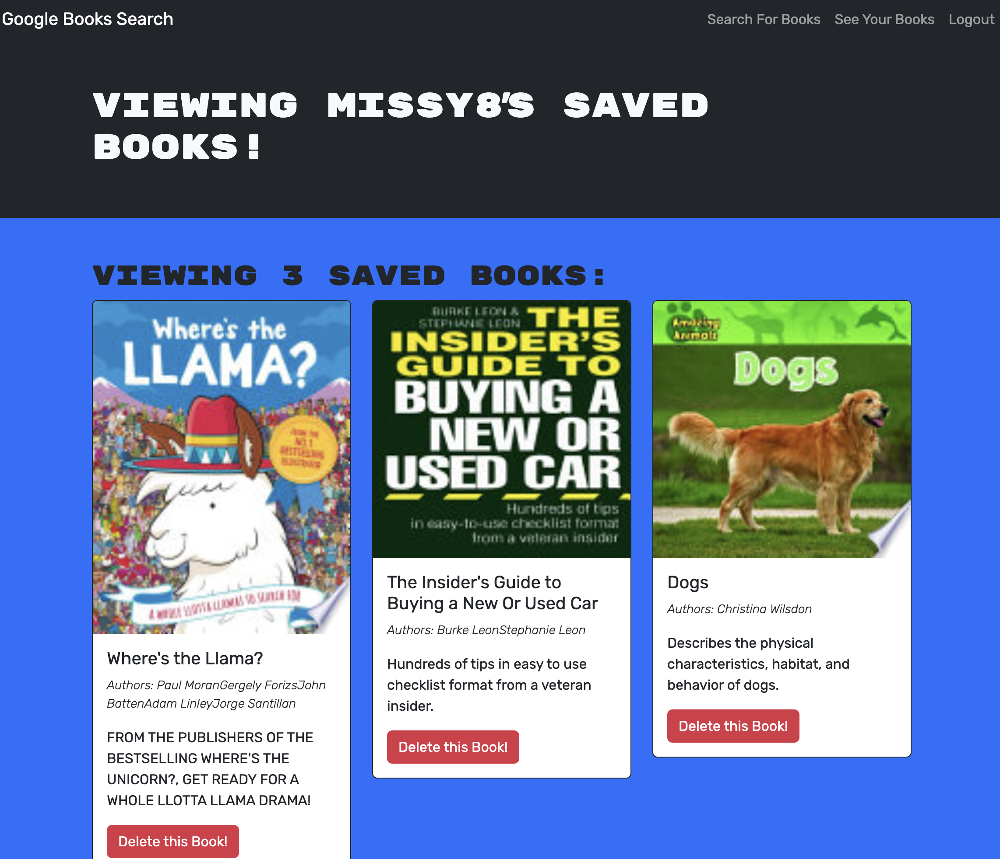

# Kikta_Book_Search_Engine
This app converts a fully functioning Google Books API search engine built with a RESTful API to be a GraphQL API built with Apollo Server.

## 📚 Description
In this application,a user can create a login and search through Google's Books API. A user can save books to their profile if they are logged in. If a user does not want a book to be in their saved library, they can delete the book. 

[Deployed Site](https://kikta-book-search-engine.onrender.com) 

## 🚀 Table of Contents
  * [Usage](#📝-Usage)
  * [Features](#⭐-features)
  * [Credits](#🫱🏽‍🫲🏾-credits)
  * [License](#📃-license)
  * [Contact](#🗨️-contact)

## 📝 Usage
<strong>Using the Social Network API</strong>

Here are screenshots of the code tested in Insomnia 

<u><strong>Login</strong></u>

<u><strong>Signup</strong></u>

<u><strong>Search</strong></u>

<u><strong>Saved Books</strong></u>

Back to [Table-of-Contents](#🚀-table-of-contents)

## ⭐ Features
  * User Login
  * Search Books
  * Save Books

Back to [Table-of-Contents](#🚀-table-of-contents)

## 🫱🏽‍🫲🏾 Credits

This applications requires the use of Express.js, MongoDB database, and Mongoose ODM. 

[MongoDB Docs](https://www.mongodb.com/docs/)

Back to [Table-of-Contents](#🚀-table-of-contents)

## 📃 License
This application is unlicensed. 

Back to [Table-of-Contents](#🚀-table-of-contents)

## 🗨️ Contact

  <strong>Email:</strong> [MelissaKikta2025@u.northwestern.edu](mailto:MelissaKikta@u.northwestern.edu)
  
  <strong>GitHub:</strong> [GitHub.com/MelissaKikta](https://github.com/melissakikta)

Back to [Table-of-Contents](#🚀-table-of-contents)

